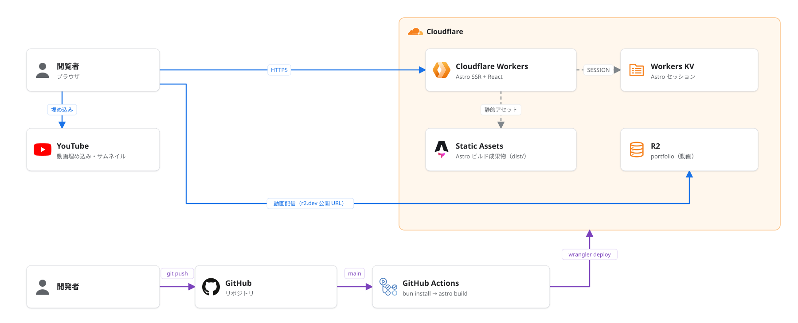

# roto-portfolio

ROTO のポートフォリオサイト。Astro + React で構築し、Cloudflare Workers にデプロイしています。

## アーキテクチャ



- `main` への push で GitHub Actions が `bun install` → `astro build` → `wrangler deploy` を実行
- Cloudflare Workers 上で Astro を SSR 実行し、ビルド成果物（`dist/`）を Static Assets として配信
- セッションは Workers KV（`SESSION`）、動画は R2（`portfolio`）の公開 URL から配信
- 作品データは `src/content/works/*.md`（Astro Content Collections）

PNG 版: [docs/architecture.png](docs/architecture.png)

## 技術スタック

| 分類 | 技術 |
|---|---|
| フレームワーク | Astro 6 / React 19 / TypeScript |
| アニメーション | GSAP / lottie-react |
| ホスティング | Cloudflare Workers（Static Assets / KV / R2） |
| CI/CD | GitHub Actions + Wrangler |
| ランタイム | Bun / Node.js（mise で管理） |

## 開発

```sh
bun install
bun run dev      # 開発サーバー
bun run build    # 本番ビルド
bun run preview  # ビルド結果のプレビュー
```

## ライセンス

[MIT](LICENSE)
